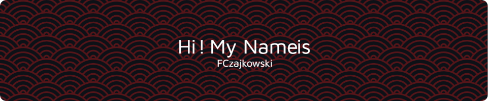

  <ul align="center" style="list-style: none">
    

      <h1>
        👋 Hello, My Name is Franciszek Czajkowski👋
      </h1>
    

  </ul>

**<h3 align="center">Connect with me:</h3>** 

  **<h3 align="left">🚀 Young Frontend/Desktop Developer with a sharp eye for optimalization. Skilled in Python, Rust & Frontend, creating clean, efficient code and intuitive user interfaces. Always learning and passionate about blending functionality with aesthetics.</h3>**

**<h3 align="left">Rapid Fire</h3>**

- 💼 I'm currently working on: **💻 Free OpenSource WebBrowser in python**
- 🌱 I'm currently learning: **📚 Rust & C**
- ⚡ Fun fact: **🎢 I once debugged friend's Java Code, while being at party**
- 📂 Portfolio: **<a href=":C" target="_blank">:C</a>**

 **<h3 align="center">Skills</h3>**

           

 **<h3 align="left">GitHub Stats</h3>**

  
  

 **<h3 align="center">Support Me</h3>**

